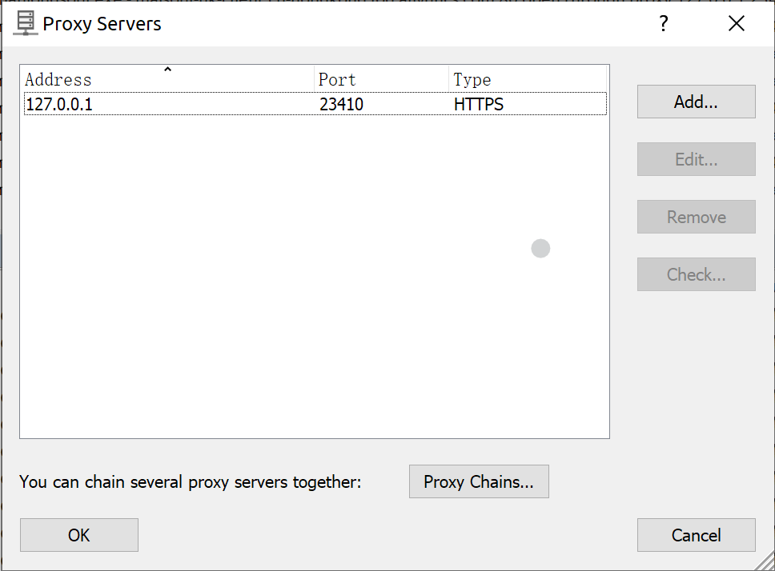
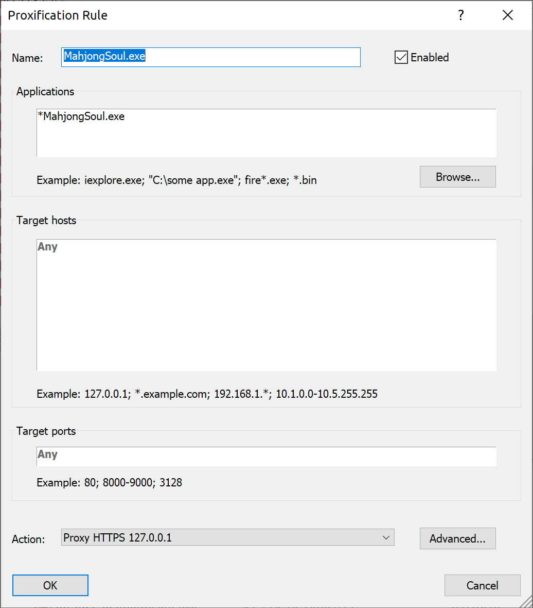
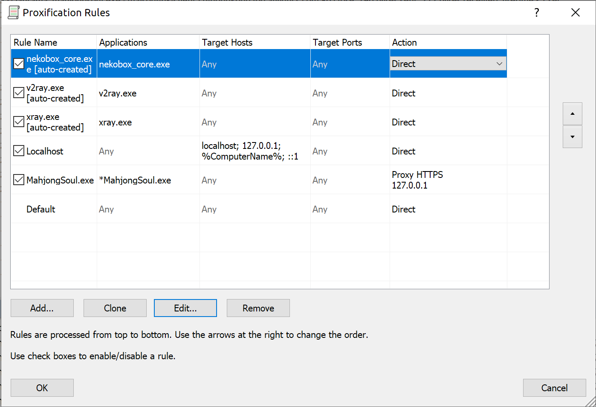
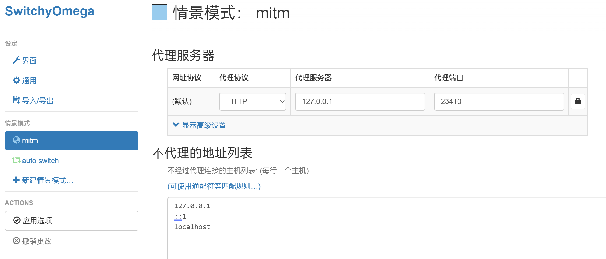
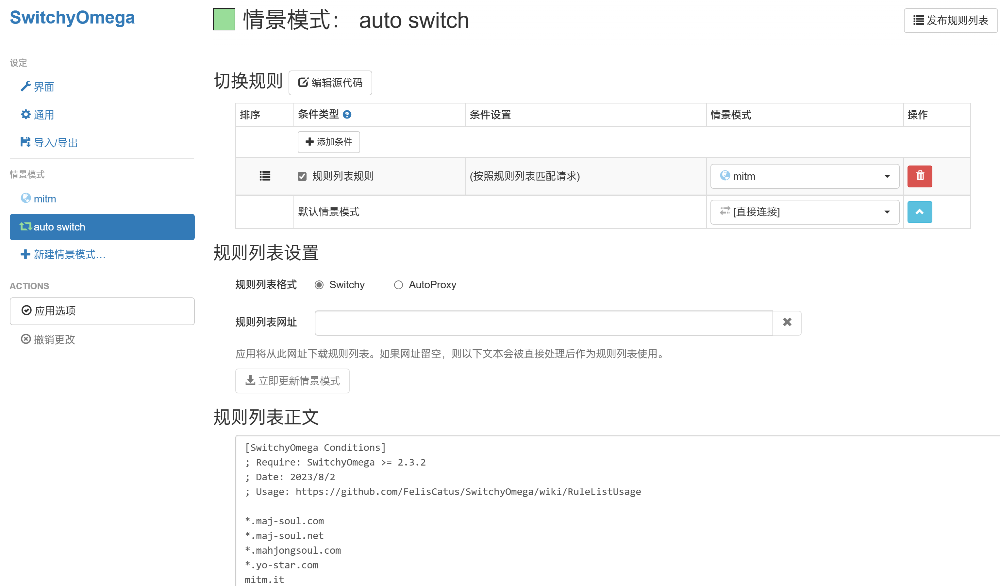
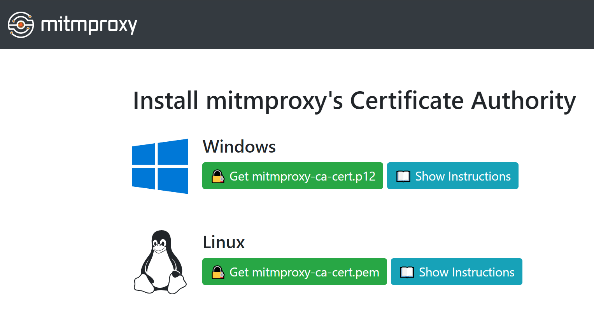

# _majsoul-hook-mitm_

本项目以**中间人攻击**的形式抓取经过代理服务器的网络通信

以实现 **修改数据、转发数据** 等功能

## 用前须知

> _魔改千万条，安全第一条。_
>
> _使用不规范，账号两行泪。_
>
> _本插件仅供学习参考交流，_
>
> _请使用者于下载 24 小时内自行删除，不得用于商业用途，否则后果自负。_

## 主要功能

- [x] 兼容小助手
- [x] 本地全皮肤
- [ ] 本地昵称
- [ ] 本地寻觅
- [x] 随机星标皮肤

### 支持平台

- 雀魂网页版、客户端

## 使用方法

安装配置 _Mitmproxy_（_Python_ >= 3.10）| 或使用[携带版](https://github.com/anosora233/majsoul-hook-mitm/releases)（可能不含最新功能）

```bash
# 同步仓库 | 或者 Download ZIP 并解压
git clone https://github.com/anosora233/majsoul-hook-mitm.git
cd majsoul-hook-mitm
# 配置国内镜像源 (可选)
python -m pip install --upgrade pip
pip config set global.index-url https://mirror.nju.edu.cn/pypi/web/simple
# 添加小助手 (可选)
cp path/to/mahjong-helper.exe aider.exe
# 安装依赖
python -m pip install -r requirements.txt
# 启动 Mitmproxy 代理服务器
python mhm-console.py
```

### 客户端

1. 配置 _Proxifier_ 添加代理服务器

   

2. 配置代理规则（建议将 _Default_ 规则改为直连）

   
   

3. 在 _Steam_ 启动游戏即可

4. 不使用本插件时关闭 _Proxifier_ 即可

### 网页版

1. 浏览器添加 _SwitchyOmega_ 插件，配置代理规则并应用

   
   

2. 在浏览器访问 [_mitm.it_](http://mitm.it) 并安装 _CA_ 证书

   

3. 在浏览器启动游戏即可

4. 不使用本插件时切换 _SwitchyOmega_ 代理规则即可

## 配置文件

首次启动 _Mitmproxy_ 代理服务器后会自动生成配置文件 _settings.json_

**默认不启用任何功能**，请根据需求自行配置编辑 _settings.json_

| 释义         | 键               | 可用值                |
| ------------ | ---------------- | --------------------- |
| 日志等级     | log_level        | debug \| info \| warn |
| 监听端口     | listen_port      | 0 - 65535             |
| 前置代理     | upstream_proxy   | null \| http://...    |
| 启用小助手   | enable_aider     | true \| false         |
| 启用全皮肤   | enable_skins     | true \| false         |
| 随机星标皮肤 | random_star_char | true \| false         |

## 特别感谢

- [Avenshy](https://github.com/Avenshy/mahjong-helper-majsoul-mitmproxy)
- [skywind3000](https://github.com/skywind3000/PyStand)
- [747929791](https://github.com/747929791/majsoul_wrapper)
- [EndlessCheng](https://github.com/EndlessCheng/mahjong-helper)
