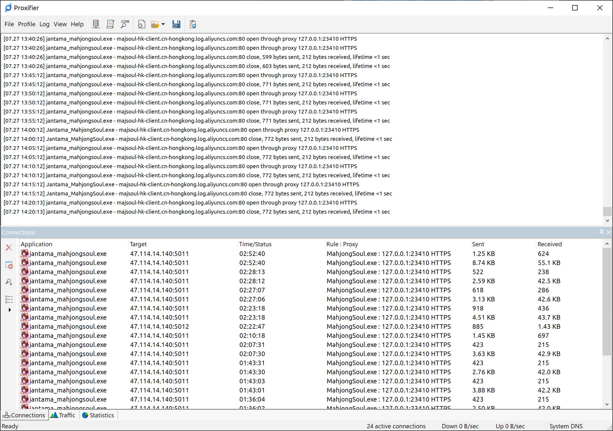

# richi-console

基于 Avenshy 的 [这个项目](https://github.com/Avenshy/mahjong-helper-majsoul-mitmproxy)

并在其基础上添加了一些扩展功能

在 Windows 10 64 位系统上 Steam 客户端通过测试。

## 用前须知

> 魔改千万条，安全第一条。
>
> 使用不规范，账号两行泪。
>
> 本插件仅供学习参考交流，
>
> 请使用者于下载 24 小时内自行删除，不得用于商业用途，否则后果自负。

## 使用方法

1. 启动 Mitmproxy 代理服务器

   ```powershell
   # 同步仓库 | 或者 Download ZIP 并解压
   git clone https://github.com/anosora233/richi-console.git
   cd richi-console
   # 配置国内镜像源 (可选)
   python -m pip install --upgrade pip
   pip config set global.index-url https://mirror.nju.edu.cn/pypi/web/simple
   # 安装依赖
   python -m pip install -r requirements.txt
   # 启动 Mitmproxy
   python richi-console.py
   ```

2. 配置 Proxifier 添加代理服务器

   

3. 配置代理规则（建议将 Default 改为直连）

   
   

4. 在 Steam 启动游戏即可，正常可以在 Mitmproxy 中看到日志

   

## 配置文件

首次启动 Mitmproxy 代理服务器后会自动生成配置文件 settings.json

| 键             | 释义       | 默认值                   | 示例                     |
| -------------- | ---------- | ------------------------ | ------------------------ |
| enable_helper  | 启用小助手 | false                    | false                    |
| enable_skins   | 启用全皮肤 | false                    | true                     |
| upstream_proxy | 上游代理   | 无                       | http://localhost:2080    |
| api_url        | 小助手地址 | https://localhost:12121/ | https://localhost:12121/ |

## 特别感谢

- [Avenshy/majsoul-mitmproxy](https://github.com/Avenshy/mahjong-helper-majsoul-mitmproxy)

- [EndlessCheng/mahjong-helper](https://github.com/EndlessCheng/mahjong-helper)

- [skywind3000/PyStand](https://github.com/skywind3000/PyStand)

- [747929791/majsoul_wrapper](https://github.com/747929791/majsoul_wrapper)
